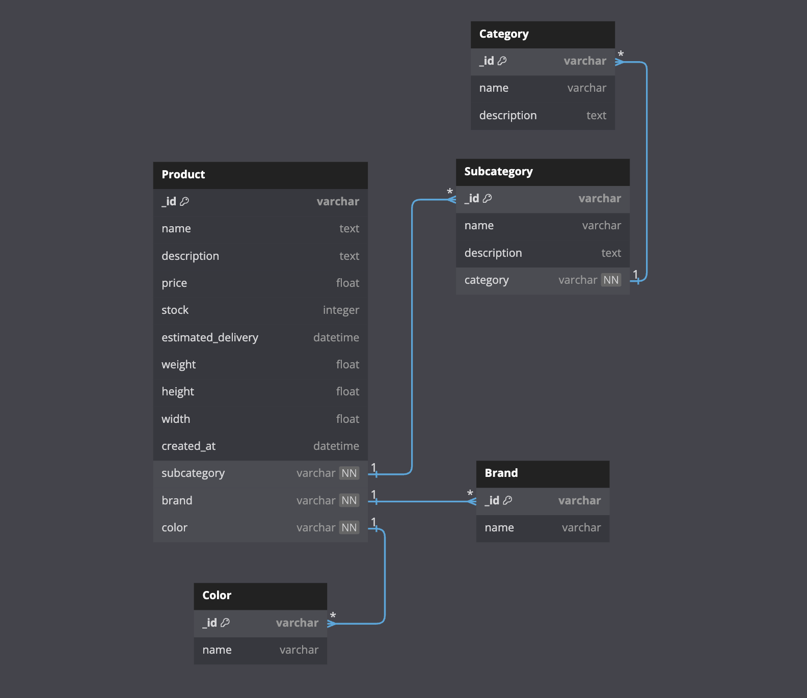

# Catalogue API

Le microservice de catalogue est une composante critique de l'architecture microservices d'Archidéco. Il est responsable de la gestion de tous les aspects relatifs aux produits, catégories et stocks.

#### L'API Catalogue est disponible sur le port `8081`.

## Responsabilités

- Gestion des catégories de produits, meilleures ventes, aiguillage en magasin.
- Gestion des produits (ajout, modification, suppression, catégories et sous-catégories).
- Gestion des stocks et des disponibilités.

## Modélisation de la base de données

Nous avons choisi MongoDB comme base de données pour plusieurs raisons :

- **Scalabilité** : MongoDB est conçu pour être scalable, ce qui permet de gérer efficacement une grande quantité de données et d'augmenter les capacités de stockage et de traitement à mesure que les besoins de l'application croissent.
- **Flexibilité du schéma** : MongoDB utilise un modèle de données flexible basé sur des documents, ce qui permet de stocker des données semi-structurées sans avoir à définir un schéma strict à l'avance. Cela est particulièrement utile pour gérer des données hétérogènes et évolutives.
- **Performance** : MongoDB offre des performances élevées pour les opérations de lecture et d'écriture, grâce à des fonctionnalités telles que l'indexation et le partitionnement horizontal (sharding).
- **Écosystème riche** : MongoDB dispose d'un écosystème riche comprenant des outils de gestion, de surveillance et de visualisation des données, ainsi que des bibliothèques et des frameworks pour faciliter le développement.
- **Communauté et support** : MongoDB bénéficie d'une large communauté de développeurs et d'un support professionnel, ce qui garantit des ressources abondantes et une assistance fiable en cas de besoin.

L'utilisation de MongoDB nous permet de répondre aux exigences de flexibilité, de scalabilité et de performance de la plateforme e-commerce **Archidéco**, tout en simplifiant la gestion et l'évolution des données.



## Endpoints nécessaires

- `GET /api/catalogue/best-sellers`: Récupération des meilleures ventes.
- `GET /api/catalogue/store/{id}`: Aiguillage en magasin.

- `GET /api/catalogue/products`: Récupération des produits.
- `GET /api/catalogue/products/sub/{category_uuid}`: Récupération des produits d'une sous-catégorie.
- `GET /api/catalogue/products/{product_uuid}`: Récupération d'un produit.
- `POST /api/catalogue/products`: Ajout d'un nouveau produit.
- `PATCH /api/catalogue/products/{id}`: Mise à jour d'un produit.
- `DELETE /api/catalogue/products/{id}`: Suppression d'un produit.

- `GET /api/catalogue/subcategories`: Récupération des sous-catégories de produits.
- `POST /api/catalogue/subcategories`: Ajout d'une sous-catégorie.
- `GET /api/catalogue/subcategories/{uuid}`: Récupération d'une sous-catégorie.
- `PATCH /api/catalogue/subcategories/{uuid}`: Mise à jour d'une sous-catégorie.
- `DELETE /api/catalogue/subcategories/{uuid}`: Suppression d'une sous-catégorie.

- `POST /api/catalogue/categories`: Ajout d'une catégorie.
- `GET /api/catalogue/categories/{uuid}`: Récupération d'une catégorie.
- `GET /api/catalogue/categories/sub`: Récupération des sous-catégories d'une catégorie.
- `PATCH /api/catalogue/categories/{uuid}`: Mise à jour d'une catégorie.
- `DELETE /api/catalogue/categories/{uuid}`: Suppression d'une catégorie.

## Exemple d'utilisation

### Ajout d'un nouveau produit
```http
POST /api/catalogue/products
Authorization: Bearer <token>
Content-Type: application/json

{
  "name": "Canapé Moderne",
  "description": "Un canapé moderne et confortable",
  "price": 599.99,
  "stock": 10,
  "subcategory": "Meubles",
  "brand": "Confort Plus",
  "colors": ["Bleu", "Orange"],
  "weight": 25.0,
  "height": 0.9,
  "width": 2.0
}

HTTP/1.1 201 Created
Content-Type: application/json

{
  "uuid": "a2b3c4d5-e6f7-8901-2345-67890abcdef",
  "name": "Canapé Moderne",
  "description": "Un canapé moderne et confortable",
  "price": 599.99,
  "stock": 10,
  "subcategory": {
    "uuid": "d4e6f8a6-8e2b-4d1e-b55c-1f8e9d5c8b16",
    "name": "Meubles",
    "description": "Sous-catégorie de meubles"
  },
  "brand": {
    "uuid": "b1e7c3d8-98f4-4d6a-a9c2-6e8b8d1e2c1d",
    "name": "Confort Plus"
  },
  "colors": [
    {
      "uuid": "c3d1f8b6-8e9a-4d1f-b3c6-1e8e9d6c8b17",
      "name": "Bleu"
    },
    {
      "uuid": "c3d1f8b6-8e9a-4d1f-b3c6-1e8e9d6c8b18",
      "name": "Orange"
    }
  ],
  "weight": 25.0,
  "height": 0.9,
  "width": 2.0,
  "estimated_delivery": "2023-07-22T10:00:00Z",
  "created_at": "2023-07-22T10:00:00Z"
}
```

### Mise à jour d'un produit
```http
PATCH /api/catalogue/products/a2b3c4d5-e6f7-8901-2345-67890abcdef
Authorization: Bearer <token>
Content-Type: application/json

{
  "price": 549.99,
  "stock": 15
}

HTTP/1.1 200 OK
Content-Type: application/json

{
  "uuid": "a2b3c4d5-e6f7-8901-2345-67890abcdef",
  "name": "Canapé Moderne",
  "description": "Un canapé moderne et confortable",
  "price": 549.99,
  "stock": 15,
  "subcategory": {
    "uuid": "d4e6f8a6-8e2b-4d1e-b55c-1f8e9d5c8b16",
    "name": "Meubles",
    "description": "Sous-atégorie de meubles"
  },
  "brand": {
    "uuid": "b1e7c3d8-98f4-4d6a-a9c2-6e8b8d1e2c1d",
    "name": "Confort Plus"
  },
  "colors": [
    {
      "uuid": "c3d1f8b6-8e9a-4d1f-b3c6-1e8e9d6c8b17",
      "name": "Bleu"
    },
    {
      "uuid": "c3d1f8b6-8e9a-4d1f-b3c6-1e8e9d6c8b18",
      "name": "Orange"
    }
  ],
  "weight": 25.0,
  "height": 0.9,
  "width": 2.0,
  "estimated_delivery": "2023-07-22T10:00:00Z",
  "created_at": "2023-07-22T10:00:00Z"
}
```

### Suppression d'un produit
```http
DELETE /api/catalogue/products/a2b3c4d5-e6f7-8901-2345-67890abcdef
Authorization: Bearer <token>
Content-Type: application/json

HTTP/1.1 204 No Content
```

### Récupération des meilleures ventes
```http
GET /api/catalogue/best-sellers
Authorization: Bearer <token>
Content-Type: application/json

HTTP/1.1 200 OK
Content-Type: application/json

[
  {
    "uuid": "a2b3c4d5-e6f7-8901-2345-67890abcdef",
    "name": "Canapé Moderne",
    "description": "Un canapé moderne et confortable",
    "price": 549.99,
    "stock": 15,
    "category": {
      "uuid": "d4e6f8a6-8e2b-4d1e-b55c-1f8e9d5c8b16",
      "name": "Meubles",
      "description": "Catégorie de meubles"
    },
    "brand": {
      "uuid": "b1e7c3d8-98f4-4d6a-a9c2-6e8b8d1e2c1d",
      "name": "Confort Plus"
    },
    "colors": [
      {
        "uuid": "c3d1f8b6-8e9a-4d1f-b3c6-1e8e9d6c8b17",
        "name": "Bleu"
      },
      {
        "uuid": "c3d1f8b6-8e9a-4d1f-b3c6-1e8e9d6c8b18",
        "name": "Orange"
      }
    ],
    "weight": 25.0,
    "height": 0.9,
    "width": 2.0,
    "estimated_delivery": "2023-07-22T10:00:00Z",
    "created_at": "2023-07-22T10:00:00Z"
  }
]
```

### Récupération des produits
```http
GET /api/catalogue/products
Authorization: Bearer <token>
Content-Type: application/json

HTTP/1.1 200 OK
Content-Type: application/json

[
  {
    "uuid": "a2b3c4d5-e6f7-8901-2345-67890abcdef",
    "name": "Canapé Moderne",
    "description": "Un canapé moderne et confortable",
    "price": 549.99,
    "stock": 15,
    "category": {
      "uuid": "d4e6f8a6-8e2b-4d1e-b55c-1f8e9d5c8b16",
      "name": "Meubles",
      "description": "Catégorie de meubles"
    },
    "brand": {
      "uuid": "b1e7c3d8-98f4-4d6a-a9c2-6e8b8d1e2c1d",
      "name": "Confort Plus"
    },
    "colors": [
      {
        "uuid": "c3d1f8b6-8e9a-4d1f-b3c6-1e8e9d6c8b17",
        "name": "Bleu"
      },
      {
        "uuid": "c3d1f8b6-8e9a-4d1f-b3c6-1e8e9d6c8b18",
        "name": "Orange"
      }
    ],
    "weight": 25.0,
    "height": 0.9,
    "width": 2.0,
    "estimated_delivery": "2023-07-22T10:00:00Z",
    "created_at": "2023-07-22T10:00:00Z"
  }
]
```

### Récupération des produits d'une sous-catégorie
```http
GET /api/catalogue/products/sub/d4e6f8a6-8e2b-4d1e-b55c-1f8e9d5c8b16
Authorization: Bearer <token>
Content-Type: application/json

HTTP/1.1 200 OK
Content-Type: application/json

[
  {
    "uuid": "a2b3c4d5-e6f7-8901-2345-67890abcdef",
    "name": "Canapé Moderne",
    "description": "Un canapé moderne et confortable",
    "price": 549.99,
    "stock": 15,
    "subcategory": {
      "uuid": "d4e6f8a6-8e2b-4d1e-b55c-1f8e9d5c8b16",
      "name": "Meubles",
      "description": "Sous-catégorie de meubles"
    },
    "brand": {
      "uuid": "b1e7c3d8-98f4-4d6a-a9c2-6e8b8d1e2c1d",
      "name": "Confort Plus"
    },
    "colors": [
      {
        "uuid": "c3d1f8b6-8e9a-4d1f-b3c6-1e8e9d6c8b17",
        "name": "Bleu"
      },
      {
        "uuid": "c3d1f8b6-8e9a-4d1f-b3c6-1e8e9d6c8b18",
        "name": "Orange"
      }
    ],
    "weight": 25.0,
    "height": 0.9,
    "width": 2.0,
    "estimated_delivery": "2023-07-22T10:00:00Z",
    "created_at": "2023-07-22T10:00:00Z"
  }
]
```

### Récupération des catégories
```http
GET /api/catalogue/categories
Authorization: Bearer <token>
Content-Type: application/json

HTTP/1.1 200 OK
Content-Type: application/json

[
  {
    "uuid": "d4e6f8a6-8e2b-4d1e-b55c-1f8e9d5c8b16",
    "name": "Meubles",
    "description": "Catégorie de meubles"
  }
]
```

### Ajout d'une catégorie
```http
POST /api/catalogue/categories
Authorization: Bearer <token>
Content-Type: application/json

{
  "name": "Meubles",
  "description": "Catégorie de meubles"
}

HTTP/1.1 201 Created
Content-Type: application/json

{
  "uuid": "d4e6f8a6-8e2b-4d1e-b55c-1f8e9d5c8b16",
  "name": "Meubles",
  "description": "Catégorie de meubles"
}
```

### Récupération d'une catégorie
```http
GET /api/catalogue/categories/d4e6f8a6-8e2b-4d1e-b55c-1f8e9d5c8b16
Authorization: Bearer <token>
Content-Type: application/json

HTTP/1.1 200 OK
Content-Type: application/json

{
  "uuid": "d4e6f8a6-8e2b-4d1e-b55c-1f8e9d5c8b16",
  "name": "Meubles",
  "description": "Catégorie de meubles"
}
```

### Récupération des sous-catégories d'une catégorie
```http
GET /api/catalogue/categories/sub
Authorization: Bearer <token>
Content-Type: application/json

HTTP/1.1 200 OK
Content-Type: application/json

[
  {
    "uuid": "e6b7c8d9-01f2-3456-7890-a1b2c3d4e5f6",
    "name": "Canapés",
    "description": "Sous-catégorie de meubles",
    "category": {
      "uuid": "d4e6f8a6-8e2b-4d1e-b55c-1f8e9d5c8b16",
      "name": "Meubles"
    }
  }
]
```

### Mise à jour d'une catégorie
```http
PATCH /api/catalogue/categories/d4e6f8a6-8e2b-4d1e-b55c-1f8e9d5c8b16
Authorization: Bearer <token>
Content-Type: application/json

{
  "name": "Meubles Modernes",
  "description": "Catégorie de meubles modernes"
}

HTTP/1.1 200 OK
Content-Type: application/json

{
  "uuid": "d4e6f8a6-8e2b-4d1e-b55c-1f8e9d5c8b16",
  "name": "Meubles Modernes",
  "description": "Catégorie de meubles modernes"
}
```

### Suppression d'une catégorie
```http
DELETE /api/catalogue/categories/d4e6f8a6-8e2b-4d1e-b55c-1f8e9d5c8b16
Authorization: Bearer <token>
Content-Type: application/json

HTTP/1.1 204 No Content
```

### Ajout d'une sous-catégorie
```http
POST /api/catalogue/subcategories
Authorization: Bearer <token>
Content-Type: application/json

{
  "name": "Canapés",
  "description": "Sous-catégorie de meubles",
  "category": "Meubles"
}

HTTP/1.1 201 Created
Content-Type: application/json

{
  "uuid": "e6b7c8d9-01f2-3456-7890-a1b2c3d4e5f6",
  "name": "Canapés",
  "description": "Sous-catégorie de meubles",
  "category": {
    "uuid": "d4e6f8a6-8e2b-4d1e-b55c-1f8e9d5c8b16",
    "name": "Meubles"
  }
}
```

### Récupération d'une sous-catégorie
```http
GET /api/catalogue/subcategories/e6b7c8d9-01f2-3456-7890-a1b2c3d4e5f6
Authorization: Bearer <token>
Content-Type: application/json

HTTP/1.1 200 OK
Content-Type: application/json

{
  "uuid": "e6b7c8d9-01f2-3456-7890-a1b2c3d4e5f6",
  "name": "Canapés",
  "description": "Sous-catégorie de meubles",
  "category": {
    "uuid": "d4e6f8a6-8e2b-4d1e-b55c-1f8e9d5c8b16",
    "name": "Meubles"
  }
}
```

### Mise à jour d'une sous-catégorie
```http
PATCH /api/catalogue/subcategories/e6b7c8d9-01f2-3456-7890-a1b2c3d4e5f6
Authorization: Bearer <token>
Content-Type: application/json

{
  "name": "Canapés Modernes",
  "description": "Sous-catégorie de meubles modernes"
}

HTTP/1.1 200 OK
Content-Type: application/json

{
  "uuid": "e6b7c8d9-01f2-3456-7890-a1b2c3d4e5f6",
  "name": "Canapés Modernes",
  "description": "Sous-catégorie de meubles modernes",
  "category": {
    "uuid": "d4e6f8a6-8e2b-4d1e-b55c-1f8e9d5c8b16",
    "name": "Meubles"
  }
}
```

### Suppression d'une sous-catégorie
```http
DELETE /api/catalogue/subcategories/e6b7c8d9-01f2-3456-7890-a1b2c3d4e5f6
Authorization: Bearer <token>
Content-Type: application/json

HTTP/1.1 204 No Content
```