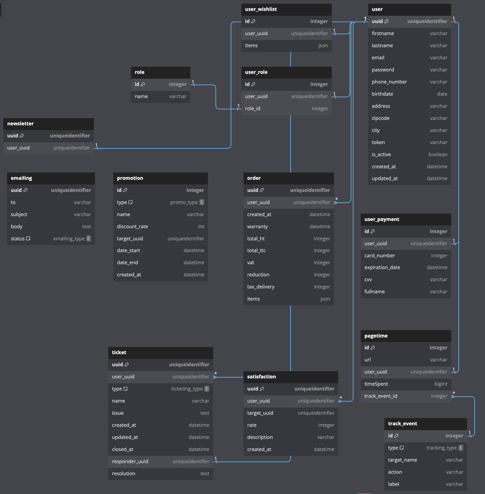
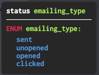

# Développement des microservices pour la société Archidéco

Pour répondre aux exigences de l'architecture du projet **Archidéco**, nous allons détailler les microservices en mettant en avant leurs responsabilités, interactions, choix technologiques et exemples de mise en œuvre.

Cette architecture microservices permet une gestion modulaire et évolutive de toutes les fonctionnalités nécessaires au fonctionnement de la plateforme e-commerce **Archidéco**. Chaque microservice est responsable d'une partie spécifique du système, ce qui facilite le développement, le déploiement et la maintenance. Les intégrations avec des API externes et l'utilisation de technologies modernes garantissent une performance optimale et une excellente expérience utilisateur.

#### L'API interne est accessible sur le port `8080`.

Voici une description approfondie des microservices :

## Table des matières

- [Microservices internes (API principale e-commerce)](#microservices-internes-api-principale-e-commerce)
  - [User Service](./ecommerce/user-service.md)
  - [Order Service](./ecommerce/order-service.md)
  - [Commerce Service](./ecommerce/commerce-service.md)
  - [Customer Service](./ecommerce/customer-service.md)
  - [Emailing Service](./ecommerce/emailing-service.md)
  - [Analytics Service](./ecommerce/analytics-service.md)
- [Interactions avec catalogue-api et delivery-api](#interactions-avec-catalogue-api-et-delivery-api)
  - [Catalogue Service](./catalogue.md)
  - [Delivery Service](./delivery.md)

Ces services sont intégrés avec les microservices internes pour fournir une solution complète de gestion des commandes et des livraisons, ainsi que la gestion des produits et des catalogues.

## Modélisation de la base de données

Nous avons choisi MySQL comme base de données pour l'API e-commerce pour plusieurs raisons :

- **Fiabilité et maturité** : base de données relationnelle éprouvée et fiable, utilisée par de nombreuses entreprises à travers le monde. Sa maturité et sa stabilité en font un choix sûr pour les applications critiques.
- **Support des transactions** : support complet des transactions, ce qui est essentiel pour garantir la cohérence et l'intégrité des données dans une application e-commerce.
- **Performances optimisées** : optimisé pour les performances avec des capacités d'indexation avancées, des options de configuration pour optimiser les requêtes et une gestion efficace de la mémoire.
- **Compatibilité avec les standards SQL** : compatibilité avec les standards SQL, ce qui facilite la migration et l'intégration avec d'autres systèmes de gestion de bases de données.

L'utilisation de MySQL pour l'API e-commerce de la plateforme **Archidéco** permet de garantir une gestion efficace des transactions, une haute performance et une intégrité des données, tout en profitant de l'écosystème riche et du support communautaire de MySQL.

   