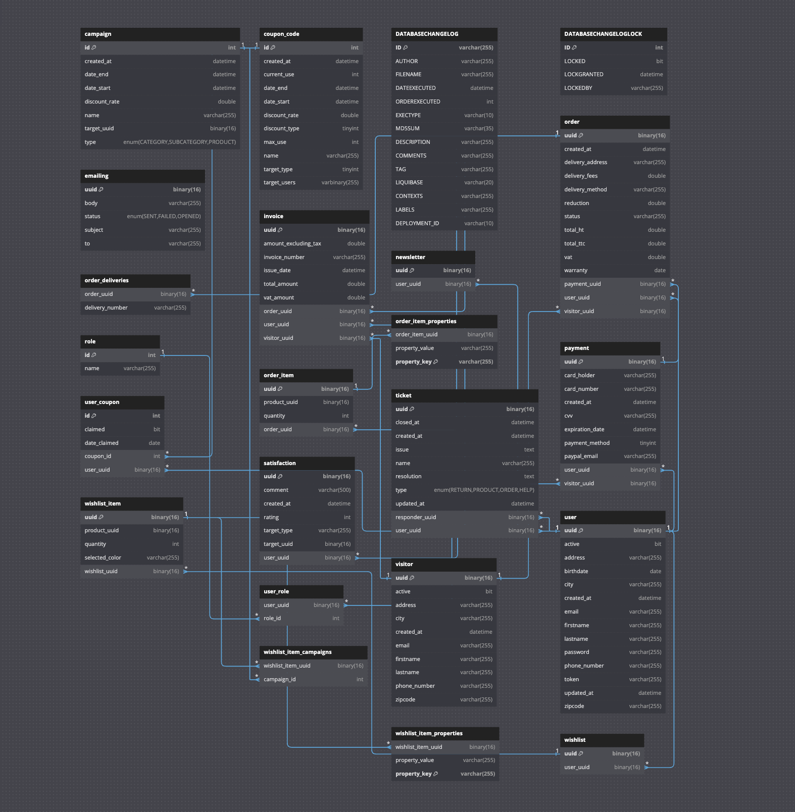
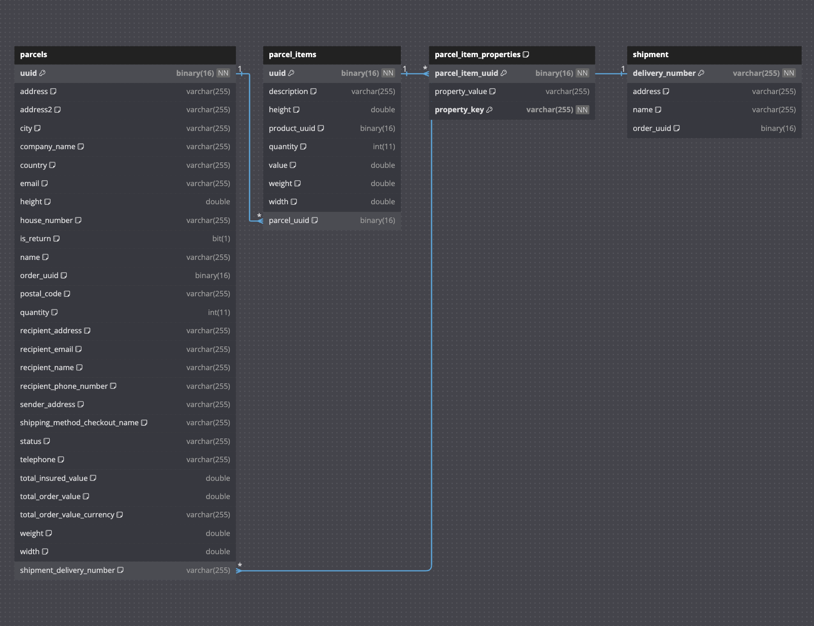
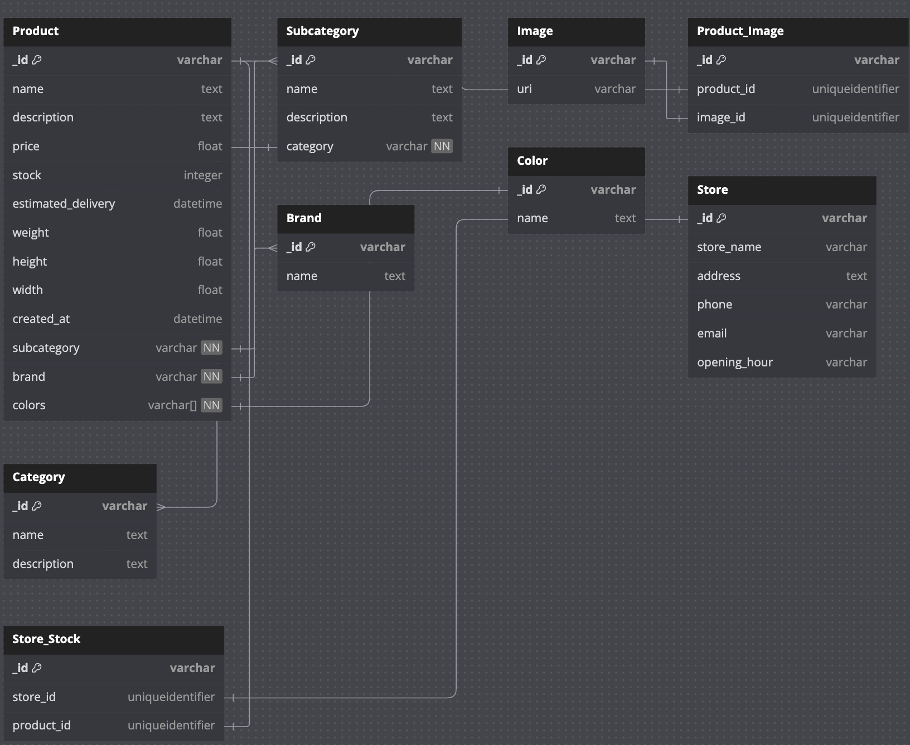

# Développement des microservices pour la société Archidéco

Pour répondre aux exigences de l'architecture du projet **Archidéco**, nous allons détailler les microservices en mettant en avant leurs responsabilités, interactions, choix technologiques et exemples de mise en œuvre.

Cette architecture microservices permet une gestion modulaire et évolutive de toutes les fonctionnalités nécessaires au fonctionnement de la plateforme e-commerce **Archidéco**. Chaque microservice est responsable d'une partie spécifique du système, ce qui facilite le développement, le déploiement et la maintenance. Les intégrations avec des API externes et l'utilisation de technologies modernes garantissent une performance optimale et une excellente expérience utilisateur.

## Présentation des Microservices externes

### API de livraison

Le microservice de livraison est une composante essentielle de l'architecture microservices d'Archidéco. Il est responsable de la gestion de toutes les opérations liées à la livraison des produits commandés par les clients.

#### Responsabilités

- Gestion des livraisons.
- Intégration potentielle avec des API de livraison externes (La Poste, Chronopost, etc.).
- Suivi et mise à jour des statuts de livraison.

### API de Centrale d'Achat/Catalogue

Le microservice de catalogue est une composante critique de l'architecture microservices d'Archidéco. Il est responsable de la gestion de tous les aspects relatifs aux produits, catégories et stocks.

#### Responsabilités

- Gestion des catégories de produits, meilleures ventes, aiguillage en magasin.
- Gestion des produits (ajout, modification, suppression, catégories et sous-catégories).
- Gestion des stocks et des disponibilités.

### API Forecast et Business Analyse

Ce microservice permet de répondre aux besoins d'analyse et de gestion des données de la plateforme e-commerce **Archidéco**. Il couvre les aspects de l'extraction, de l'analyse, de la génération de rapports et de l'envoi d'emails. Il dispose d'un accès sécurisé afin d'afficher ces résultats sur l'espace administrateur de la plateforme e-commerce.

Cette approche modulaire permet une gestion efficace et évolutive des données, facilitant ainsi le développement, le déploiement et la maintenance des fonctionnalités analytiques de la plateforme.

#### Responsabilités

- Extraction des données associées aux ventes de la plateforme.
- Analyse des données et entraînement de modèles prédictifs.
- Génération de rapports d'analyse et de prédiction.

## Ports d'accès des Microservices

- API E-commerce : `port 8080`
- API Catalogue : `port 8081`
- API Delivery : `port 8082`
- API Forecast : `port 8083`

## Documentations Swagger

- Accès aux documentations des Microservices internes (API principale e-commerce) : `http://localhost:8080/swagger-ui/index.html`
- Accès aux documentations du Microservice externe de Centrale d'Achat (API catalogue) : `http://localhost:8081/swagger-ui/index.html`
- Accès aux documentations du Microservice externe de Livraison (API livraison) : `http://localhost:8082/swagger-ui/index.html`

Ces services sont intégrés avec les microservices internes pour fournir une solution complète de gestion des commandes et des livraisons, ainsi que la gestion des produits et des catalogues.

## Bases de données

### Modélisation de la base de données e-commerce

Nous avons choisi MySQL comme base de données pour l'API e-commerce pour plusieurs raisons :

- **Fiabilité et maturité** : base de données relationnelle éprouvée et fiable, utilisée par de nombreuses entreprises à travers le monde. Sa maturité et sa stabilité en font un choix sûr pour les applications critiques.
- **Support des transactions** : support complet des transactions, ce qui est essentiel pour garantir la cohérence et l'intégrité des données dans une application e-commerce.
- **Performances optimisées** : optimisé pour les performances avec des capacités d'indexation avancées, des options de configuration pour optimiser les requêtes et une gestion efficace de la mémoire.
- **Compatibilité avec les standards SQL** : compatibilité avec les standards SQL, ce qui facilite la migration et l'intégration avec d'autres systèmes de gestion de bases de données.

L'utilisation de MySQL pour l'API e-commerce de la plateforme **Archidéco** permet de garantir une gestion efficace des transactions, une haute performance et une intégrité des données, tout en profitant de l'écosystème riche et du support communautaire de MySQL.

### Modélisation de la base de données livraison

Nous avons choisi MySQL comme base de données pour l'API de livraison pour plusieurs raisons :

- **Fiabilité et maturité** : base de données relationnelle éprouvée et fiable, utilisée par de nombreuses entreprises à travers le monde. Sa maturité et sa stabilité en font un choix sûr pour les applications critiques.
- **Support des transactions** : support complet des transactions, ce qui est essentiel pour garantir la cohérence et l'intégrité des données dans une application e-commerce.
- **Performances optimisées** : optimisé pour les performances avec des capacités d'indexation avancées, des options de configuration pour optimiser les requêtes et une gestion efficace de la mémoire.
- **Compatibilité avec les standards SQL** : compatibilité avec les standards SQL, ce qui facilite la migration et l'intégration avec d'autres systèmes de gestion de bases de données.

L'utilisation de MySQL pour l'API e-commerce de la plateforme **Archidéco** permet de garantir une gestion efficace des transactions, une haute performance et une intégrité des données, tout en profitant de l'écosystème riche et du support communautaire de MySQL.

### Modélisation de la base de données catalogue

Nous avons choisi MongoDB comme base de données pour simuler la centrale d'achat pour plusieurs raisons :

- **Scalabilité** : permet de gérer efficacement une grande quantité de données et d'augmenter les capacités de stockage et de traitement à mesure que les besoins de l'application croissent.
- **Flexibilité du schéma** : modèle de données flexible basé sur des documents, ce qui permet de stocker des données semi-structurées sans avoir à définir un schéma strict à l'avance. Cela est particulièrement utile pour gérer des données hétérogènes et évolutives.
- **Performance** : performances élevées pour les opérations de lecture et d'écriture, grâce à des fonctionnalités telles que l'indexation et le partitionnement horizontal (sharding).

L'utilisation de MongoDB nous permet de répondre aux exigences de flexibilité, de scalabilité et de performance de la plateforme e-commerce **Archidéco**, tout en simplifiant la gestion et l'évolution des données.

